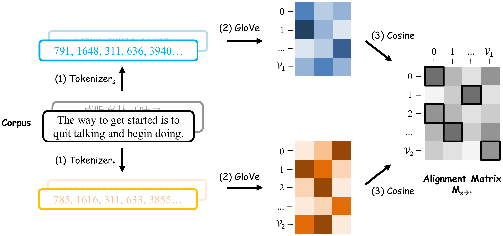

# TokAlign: Efficient Vocabulary Adaptation via Token Alignment

The code for the ACL 2025 conference paper "**TokAlign: Efficient Vocabulary Adaptation via Token Alignment**".

## Overview
We propose an efficient method named TokAlign to replace the vocabulary of LLM from the token co-occurrences view, and further transfer the token-level knowledge between models. It first aligns the source vocabulary to the target one by learning a one-to-one mapping matrix for token IDs. Model parameters, including embeddings, are rearranged and progressively fine-tuned for the new vocabulary. The following figure illustrates the method of TokAlign:



## How to run?

### Set up an virtual environment
```
conda create -n tokalign python=3.10
conda activate tokalign
pip install -r requirements.txt
```

### Prepare tokenized data

1. Download and merge multilingual, code, and math data, e.g., [CulturaX](https://huggingface.co/datasets/uonlp/CulturaX), [the-stack](https://huggingface.co/datasets/bigcode/the-stack) and [proof-pile-2](https://huggingface.co/datasets/EleutherAI/proof-pile-2) from HuggingFace. We provide a small corpus in the "./data/pretrain-corpus" directory for example. 

2. Tokenize corpus and prepare files of GloVe vector training and evaluation
```
# Replace the path with your corpus and tokenizers' path
vim script/convert2glove_corpus.sh 
bash script/convert2glove_corpus.sh 
```

### Train GloVe vectors and obtain token alignment matrix

```
git clone https://github.com/stanfordnlp/GloVe.git
# Train GloVe vectors for source vocabulary and target vocabulary
bash script/token_align.sh
```

### Evaluation of one-to-one token alignment matrix learned
```
# Change the path to the alignment matrix path for evaluation, and choose an evaluation method (BLEU-1 or Bert-score).
vim script/eval_align.sh
bash script/eval_align.sh
```

### Initialize the model weight with the token alignment matrix

```
# Modify the path of alignment matrix
vim script/init_model.sh 
bash script/init_model.sh 
```

### Vocabulary Adaptation
```
# First tokenize the training dataset used for vocabulary adaptation
vim script/tokenize_dataset.sh
bash script/tokenize_dataset.sh

# Replace some paths and hyper-parameters with yours, and start the vocabulary adaptation process
vim script/vocab_adaptation.sh
bash script/vocab_adaptation.sh
```

## 📎 Models

We open-source the following models:

| **Name**                     | **LLaMA3 Tokenizer** | **Qwen2 Tokenizer** | **Gemma Tokenizer** |
|------------------------------|:--------------------:|:-------------------:|:-------------------:|
| TokAlign                     |     [🤗](https://huggingface.co/chongli17/TokAlign-Pythia-1b-LLaMA3-Tokenizer)     |     [🤗](https://huggingface.co/chongli17/TokAlign-Pythia-1b-Qwen2-Tokenizer)    |     [🤗](https://huggingface.co/chongli17/TokAlign-Pythia-1b-Gemma-Tokenizer)    |
| + Token-level Distill         |     [🤗](https://huggingface.co/chongli17/TokAlign-Pythia-1b-Distill-LLaMA-3-8b)     |     [🤗](https://huggingface.co/chongli17/TokAlign-Pythia-1b-Distill-Qwen-2-7b)    |     [🤗](https://huggingface.co/chongli17/TokAlign-Pythia-1b-Distill-Qwen-2-7b)    |


Table 1. Models from $Pythia_{1b}$

| **Name**                     | **LLaMA3 Tokenizer** | **Qwen2 Tokenizer** | **Gemma Tokenizer** |
|------------------------------|:--------------------:|:-------------------:|:-------------------:|
| TokAlign                     |     [🤗](https://huggingface.co/chongli17/TokAlign-Pythia-6.9b-LLaMA3-Tokenizer)     |     [🤗](https://huggingface.co/chongli17/TokAlign-Pythia-6.9b-Qwen2-Tokenizer)    |     [🤗](https://huggingface.co/chongli17/TokAlign-Pythia-6.9b-Gemma-Tokenizer)    |
| + Token-level Distill         |     [🤗](https://huggingface.co/chongli17/TokAlign-Pythia-6.9b-Distill-LLaMA3-8b)     |     [🤗](https://huggingface.co/chongli17/TokAlign-Pythia-6.9b-Distill-Qwen-2-7b)    |     [🤗](https://huggingface.co/chongli17/TokAlign-Pythia-6.9b-Distill-Gemma-7b)    |


Table 2. Models from $Pythia_{6.9b}$

## How to cite our paper?
```
@inproceedings{li-etal-2025-TokAlign,
  author    = {Chong Li and
               Jiajun Zhang and
               Chengqing Zong},
  title = "TokAlign: Efficient Vocabulary Adaptation via Token Alignment",
  booktitle = "Proceedings of the 63nd Annual Meeting of the Association for Computational Linguistics (Volume 1: Long Papers)",
  year = "2025",
  address = "Vienna, Austria",
  publisher = "Association for Computational Linguistics",
}
```